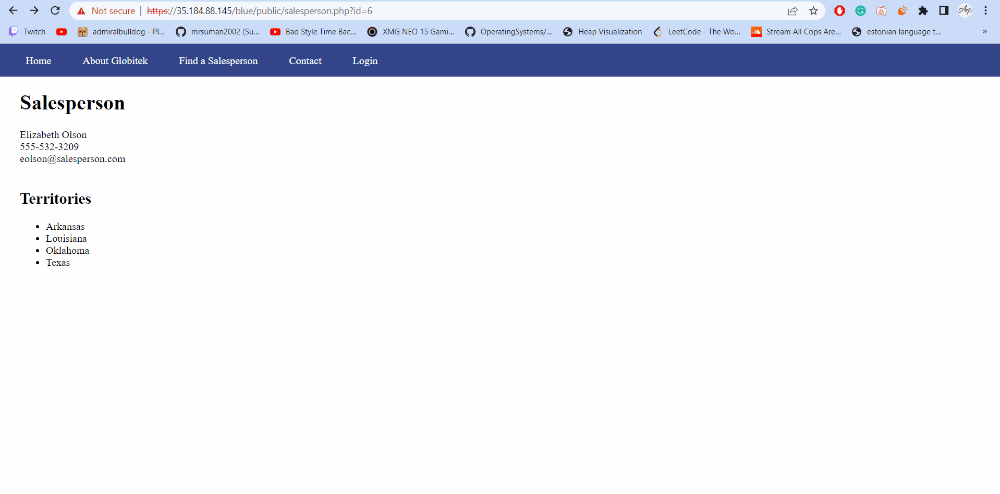
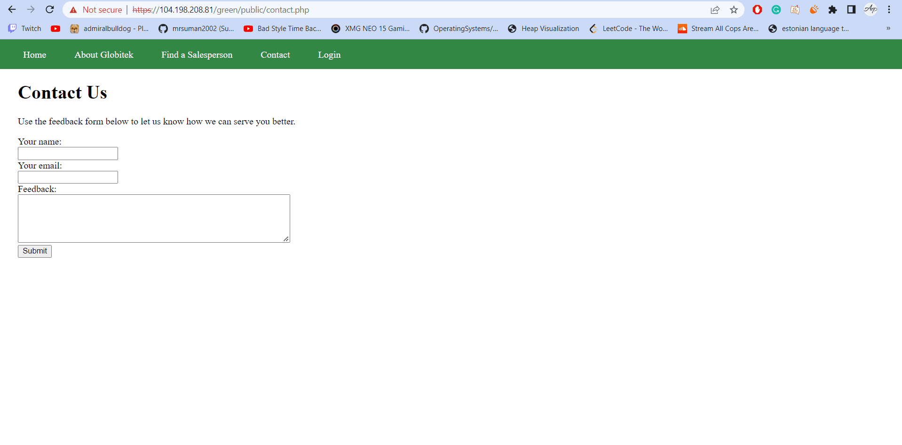
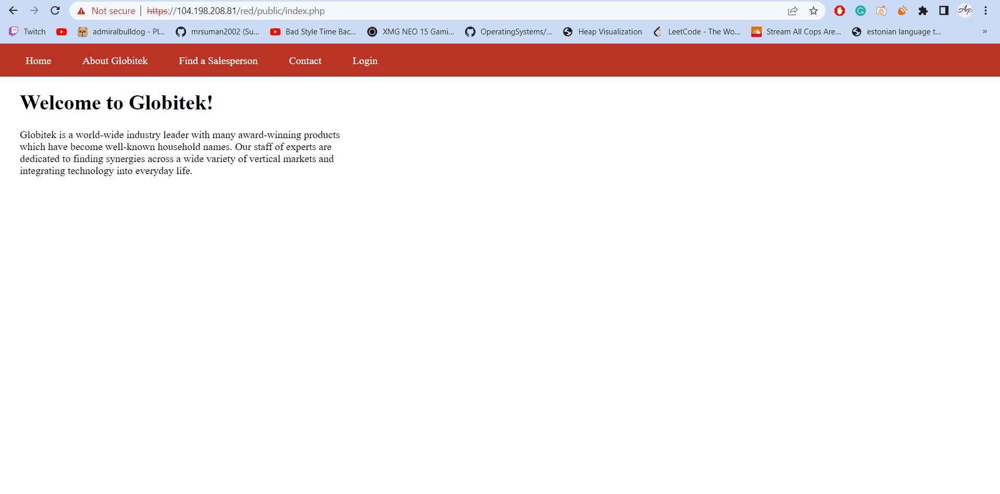

# codepath_homeworks
# Project 8 - Pentesting Live Targets

Time spent: 10 hours spent in total

> Objective: Identify vulnerabilities in three different versions of the Globitek website: blue, green, and red.

The six possible exploits are:

* Username Enumeration
* Insecure Direct Object Reference (IDOR)
* SQL Injection (SQLi)
* Cross-Site Scripting (XSS)
* Cross-Site Request Forgery (CSRF)
* Session Hijacking/Fixation

Each color is vulnerable to only 2 of the 6 possible exploits. First discover which color has the specific vulnerability, then write a short description of how to exploit it, and finally demonstrate it using screenshots compiled into a GIF.

## Blue

Vulnerability #1: ______SQL Injection____________

Description: The page "salesperson info" page is vulnerable to SQL injection. To reveal more information, use below phrase in the url: 
          ?id=5' or sleep(7)=0--'

## Green

Vulnerability #1: _______XSS___________

Description: Put malicious code in the contact form in the feedback box. Put the following line of code in the feedbcak box: 

## Red

Vulnerability #1: ___Insecire Direct Object Reference_______________

Description: In the "salesperson info", putting the following in the URL, reveals hidden information: 
      ?id=10
      ?id=11 

## Notes

It ain't much but its hard work.
